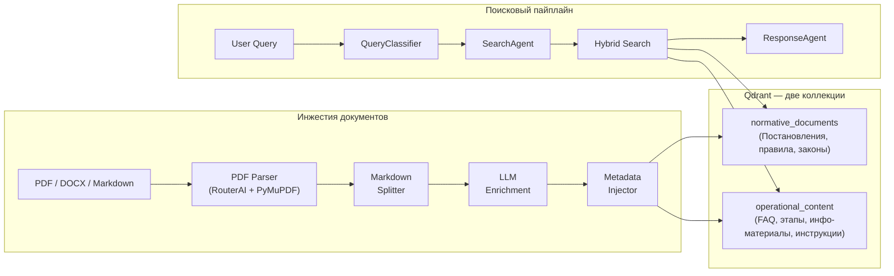
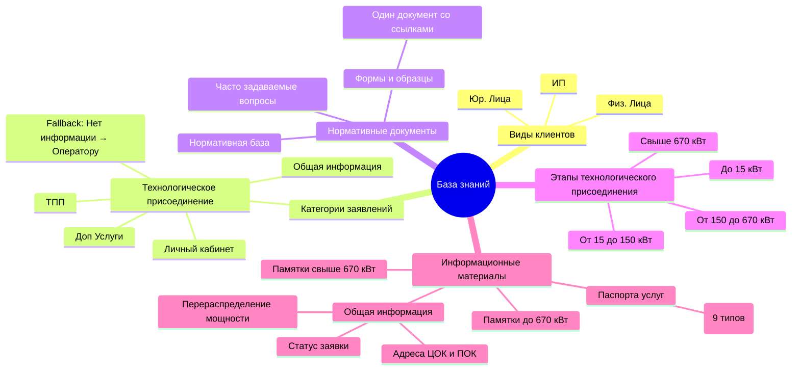

# Схема базы знаний — Bashkirenergo AI Assistant

## Архитектура инжестии (Новая)



---

## Структура данных

```mermaid
flowchart TB
    %% Title
    title["Как нам группировать документы?"]

    %% === TOP SECTION: Клиенты ===
    subgraph clients["Виды клиентов"]
        direction LR
        FL["Физ. Лица"]
        UL["Юр. Лица"]
        IP["ИП"]
    end

    %% === TOP CENTER: Категории заявлений ===
    subgraph categories["Категории заявлений"]
        direction TB
        TP["Технологическое присоединение сетям"]
        
        subgraph tp_branches[""]
            direction LR
            LK["Личный кабинет"]
            TPP["ТПП"]
            DU["Доп Услуги (ДУ)"]
            OI_TP["Общая информация"]
            NOINFO["Нет информации / Передача оператору"]
        end
    end

    TP --> LK
    TP --> TPP
    TP --> DU
    TP --> OI_TP
    TP --> NOINFO

    %% === MIDDLE: Категории доступной информации для ассистента ===
    subgraph info_categories["Категории доступной информации для ассистента"]
        direction TB
        ND["Нормативные документы"]
    end

    subgraph nd_branches[""]
        direction LR
        FAQ["Часто задаваемые вопросы"]
        NB["Нормативная база"]
        FRM["Формы и образцы"]
        IM["Информационные материалы"]
    end

    ND --> FAQ
    ND --> NB
    ND --> FRM
    ND --> IM

    %% Note on Формы и образцы
    FRM -.->|"Нужно написать один документ<br/>со ссылками на все формы"| FRM

    %% === LEFT: Этапы технологического присоединения ===
    subgraph stages["Этапы технологического присоединения"]
        direction TB
        STAGE["Этапы технологического присоединения"]
        
        subgraph power_cats[""]
            direction LR
            PW1["До 15 кВт"]
            PW2["От 15 до 150 кВт"]
            PW3["От 150 до 670 кВт"]
            PW4["Свыше 670 кВт"]
        end
    end

    STAGE --> PW1
    STAGE --> PW2
    STAGE --> PW3
    STAGE --> PW4

    ND --> STAGE

    %% === UNDER Информационные материалы ===
    subgraph im_branches[""]
        direction LR
        MEMO["Памятка до 670 кВт /<br/>Памятка свыше 670 кВт"]
        PAS["Паспорта услуг"]
    end

    IM --> MEMO
    IM --> PAS

    %% === RIGHT: Общая информация (rectangle) ===
    subgraph oi_section["Общая информация"]
        direction TB
        OI_RECT["Общая информация"]
        
        subgraph oi_items[""]
            direction LR
            ADDR["Адреса пунктов ЦОК и ПОК"]
            STAT["Узнать статус заявки"]
            RED["Перераспределение мощности"]
        end
    end

    IM --> OI_RECT
    OI_RECT --> ADDR
    OI_RECT --> STAT
    OI_RECT --> RED

    %% === BOTTOM: Виды услуг (Паспорта) ===
    subgraph services["Виды услуг (Паспорта)"]
        direction TB
        S1["Физических лиц с максимальной мощностью до 15 кВт"]
        S2["Юридических лиц и ИП с мощностью до 150 кВт"]
        S3["Юридических лиц и ИП с мощностью от 150 до 670 кВт"]
        S4["Юридических лиц и ИП с мощностью свыше 670 кВт"]
        S5["Перераспределения максимальной мощности"]
        S6["По индивидуальному проекту"]
        S7["Восстановление (переоформление) документов"]
        S8["В целях вывода из эксплуатации объектов электросетевого хозяйства"]
        S9["Временное технологическое присоединение к электрическим сетям"]
    end

    PAS --> S1
    PAS --> S2
    PAS --> S3
    PAS --> S4
    PAS --> S5
    PAS --> S6
    PAS --> S7
    PAS --> S8
    PAS --> S9

    %% === STYLING ===
    style title font-size:24px; font-weight:bold;
    style TP fill:#e1f5fe,stroke:#1e1e1e,stroke-width:2px;
    style LK fill:#fff3e0,stroke:#1e1e1e,stroke-width:1px;
    style TPP fill:#fff3e0,stroke:#1e1e1e,stroke-width:1px;
    style DU fill:#fff3e0,stroke:#1e1e1e,stroke-width:1px;
    style OI_TP fill:#f3e5f5,stroke:#1e1e1e,stroke-width:1px;
    style NOINFO fill:#ffebee,stroke:#1e1e1e,stroke-width:1px;
    style ND fill:#e8f5e9,stroke:#1e1e1e,stroke-width:2px;
    style OI_RECT fill:#e8f5e9,stroke:#1e1e1e,stroke-width:2px,stroke-dasharray:5 5;
```

---

## Иерархия категорий

```mermaid
graph LR
    subgraph L1["Уровень 1"]
        Q["Вопрос пользователя"]
    end

    subgraph L2["Уровень 2 — Категории заявлений"]
        TP["Технологическое присоединение"]
        LK["Личный кабинет"]
        DU["Доп Услуги"]
        OI_TP["Общая информация"]
        NOINFO["Нет информации → Оператору"]
    end

    subgraph L3["Уровень 3 — Информация"]
        ND["Нормативные документы"]
        FAQ["Часто задаваемые вопросы"]
        FRM["Формы и образцы"]
        STAGE["Этапы ТП"]
        IM["Информационные материалы"]
    end

    subgraph L4["Уровень 4 — Детали"]
        NB["Нормативная база"]
        PW["Мощности: до 15, 15-150, 150-670, свыше 670 кВт"]
        MEMO["Памятки"]
        PAS["Паспорта услуг"]
        OI_RECT["Общая информация"]
        ADDR["Адреса ЦОК/ПОК"]
        STAT["Статус заявки"]
        RED["Перераспределение мощности"]
    end

    Q --> L2
    L2 --> L3
    L3 --> L4

    style Q fill:#f5f5f5,stroke:#1e1e1e,stroke-width:2px;
    style TP fill:#e3f2fd,stroke:#1e1e1e,stroke-width:2px;
    style ND fill:#e8f5e9,stroke:#1e1e1e,stroke-width:2px;
    style OI_TP fill:#f3e5f5,stroke:#1e1e1e,stroke-width:1px;
    style OI_RECT fill:#e8f5e9,stroke:#1e1e1e,stroke-width:2px,stroke-dasharray:5 5;
```



---

## Архитектура базы знаний



---

## Виды услуг (Паспорта)

```mermaid
graph LR
    SERVICES["Виды услуг (Паспорта)"]

    S1["Физические лица ≤ 15 кВт"]
    S2["Юр. лица и ИП ≤ 150 кВт"]
    S3["Юр. лица и ИП 150–670 кВт"]
    S4["Юр. лица и ИП > 670 кВт"]
    S5["Перераспределение мощности"]
    S6["По индивидуальному проекту"]
    S7["Восстановление/переоформление документов"]
    S8["Вывод из эксплуатации объектов эл. сетей"]
    S9["Временное технологическое присоединение"]

    SERVICES --> S1
    SERVICES --> S2
    SERVICES --> S3
    SERVICES --> S4
    SERVICES --> S5
    SERVICES --> S6
    SERVICES --> S7
    SERVICES --> S8
    SERVICES --> S9

---

## Инсайты и технические решения

### ✅ Инсайт 1 — Несколько коллекций (IMPLEMENTED)

Документы разделены на две коллекции Qdrant:

- **`normative_documents`** — нормативно-правовые документы (Постановления, правила, законы)
- **`operational_content`** — операционный контент (FAQ, этапы ТП, общая информация, информационные материалы, инструкции)

Это позволяет более точно маршрутизировать запросы и обеспечивает лучшую релевантность при поиске.

---

### ✅ Инсайт 2 — Соседние чанки (IMPLEMENTED)

В `metadata` каждого чанка добавлено поле **`neighbor_chunk_ids`** — массив идентификаторов соседних (предыдущего и следующего) чанков для подгрузки контекста при необходимости.

Система **parent and child chunks** остаётся на будущее как потенциальное улучшение.

---

### ✅ Инсайт 3 — Стратегия чанкования (SPECIFIED)

Стратегия чанкования документов задокументирована в `docs/specs/chunking-strategy.md`:
- Размер чанка: **1000–4000 символов**
- Overlap: **200 символов**
- Разбиение по логическим границам (заголовки, абзацы)

---

### ✅ Инсайт 4 — Стратегия парсинга PDF (PLANNED)

Пайплайн парсинга запланирован и частично реализован:
- **PDF Parser**: `backend/tools/pdf_parser.py`
- Движок: **RouterAI** (основной) + **PyMuPDF fallback**
- Поддерживаемые форматы: PDF, DOCX, Markdown

---

### ✅ Инсайт 5 — Структурированные breadcrumbs (IMPLEMENTED)

В `metadata` каждого чанка добавлены структурированные **`breadcrumbs`** — путь навигации по категориям и подкатегориям.

---

## Структура metadata для чанков

Полная актуальная структура metadata для каждого чанка:

```yaml
metadata:
  # Идентификация
  chunk_id: "uuid"
  source_file: "path/to/document.pdf"
  neighbor_chunk_ids:               # id соседних чанков (prev / next)
    - "uuid_prev"
    - "uuid_next"

  # Навигация
  breadcrumbs:                     # структурированный путь
    - category: "Технологическое присоединение"
    - subcategory: "Этапы ТП"
    - detail: "До 15 кВт"

  # Семантическое описание
  chunk_summary: "Краткое резюме чанка"
  chunk_content: "Основное содержимое чанка"
  hypothetical_questions:          # гипотетические вопросы пользователя
    - "Вопрос 1"
    - "Вопрос 2"
  keywords: ["keyword1", "keyword2"]
  entities: ["Сущность 1", "Сущность 2"]

  # Метаданные документа
  collection_name: "normative_documents"   # или "operational_content"
  document_type: "faq"                     # faq, normative, stage, info_material, instruction
  category: "Категория документа"
  power_range: "до 15 кВт"                 # категория мощности
  client_type: "ФЛ"                        # ФЛ, ЮЛ, ИП
```