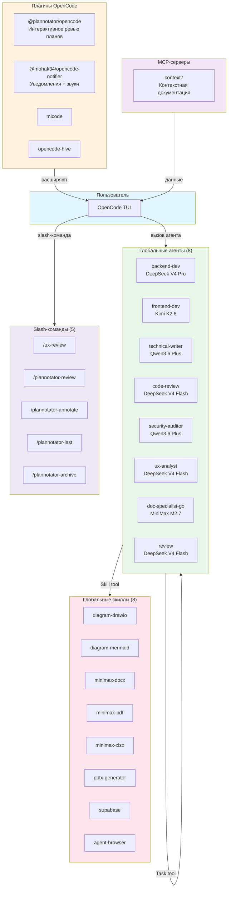
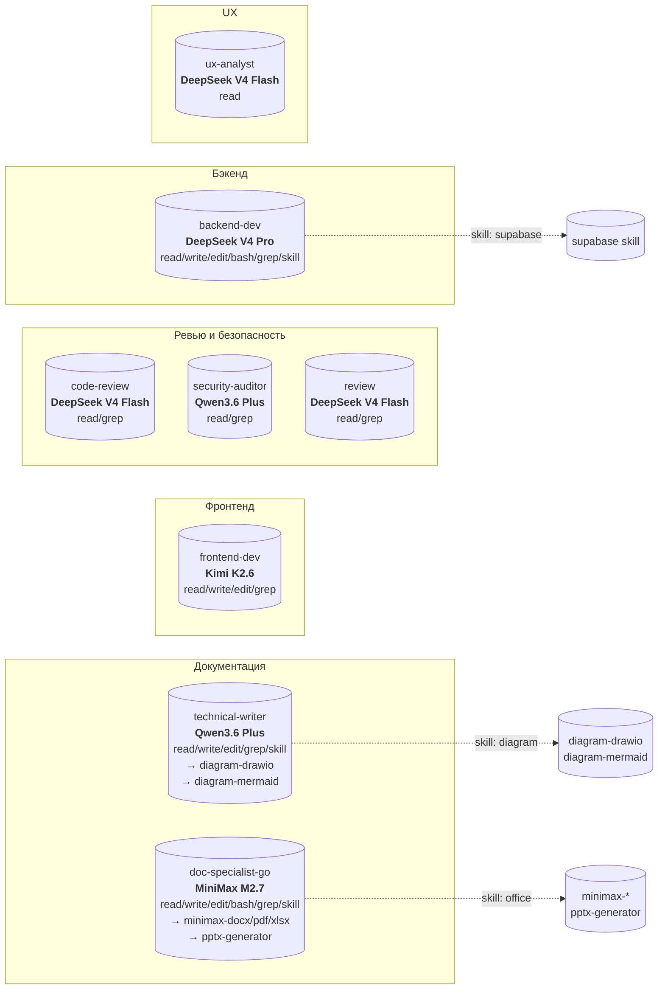
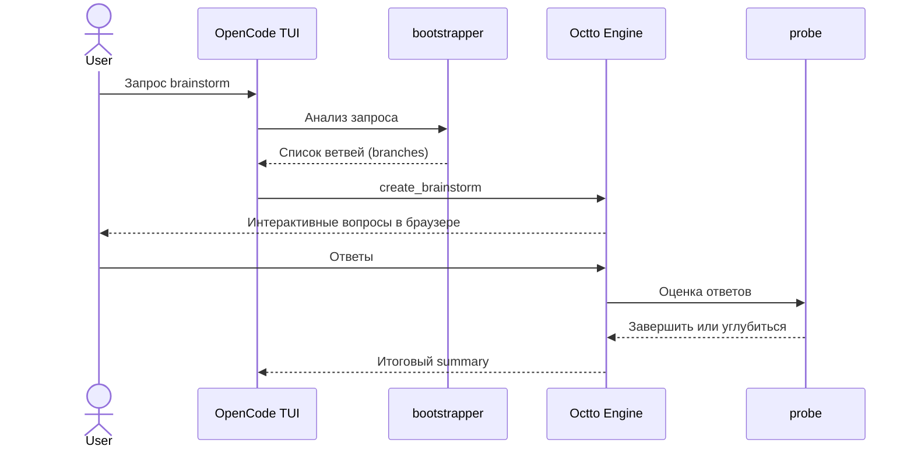
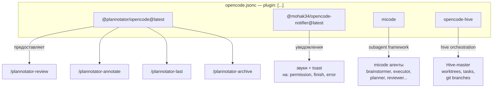
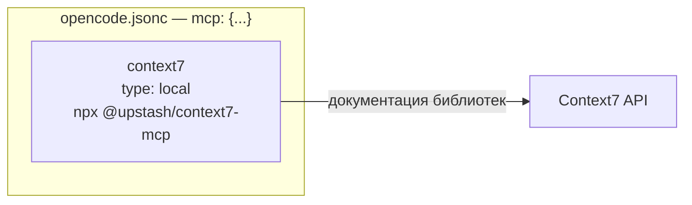
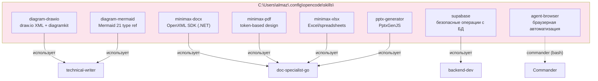
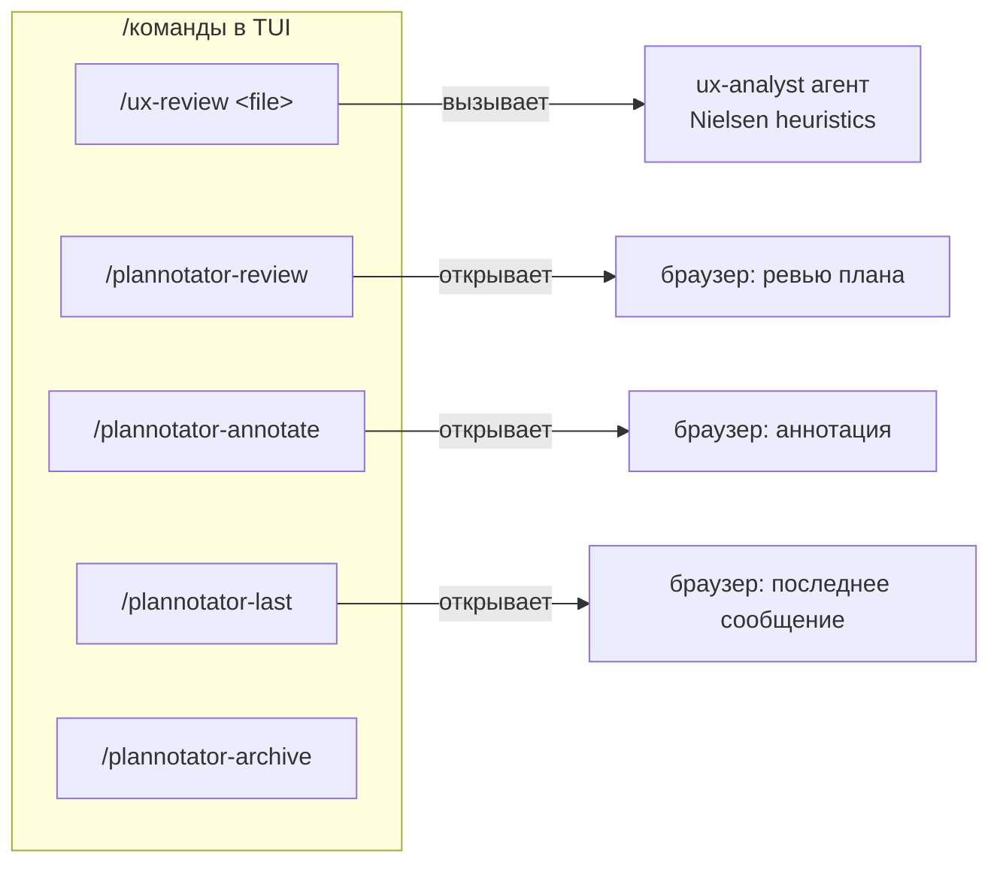
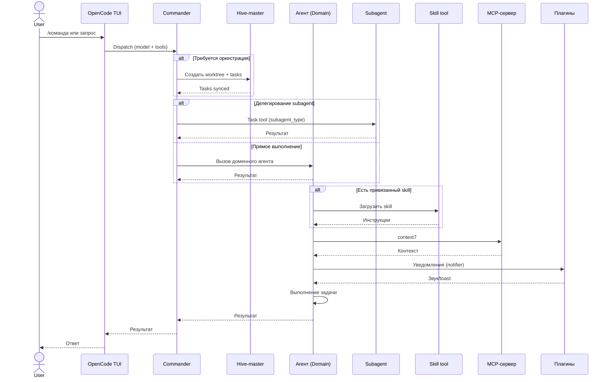

# Agent Ecosystem — OpenCode Configuration Guide

Дата: 2026-05-01
Версия конфигурации: финальная

---

## 1. Общая архитектура

---

## 2. Иерархия ролей

Экосистема работает по принципу **иерархического делегирования**. Не все агенты равны — есть разделение на роли верхнего уровня (оркестрация и принятие решений), доменные агенты (специалисты по направлениям) и вспомогательные subagents (разведка, планирование, исполнение).

### 2.1. Роли верхнего уровня

| Роль | Назначение | Кто вызывает |
|---|---|---|
| **Commander** | Senior engineer. Принимает решения, даёт добро на план, запускает исполнение, коммитит результат. Не пишет код напрямую — делегирует. | Пользователь напрямую |
| **Hive-master** | Гибридный планировщик + оркестратор. Определяет фазу проекта, подгружает нужные skills on-demand, синхронизирует tasks и worktrees. | Commander или автоматически при complex tasks |

**Commander** — это единственная роль, которая имеет право:
- одобрить или отклонить план перед имплементацией;
- создать коммит и смержить ветку;
- принять архитектурное решение при конфликте subagents.

**Hive-master** берёт на себя рутину оркестрации:
- создание фиче-бранчей и git worktrees;
- генерацию task-списка из plan.md;
- отслеживание статуса задач (pending → in-progress → completed);
- merge completed task branches.

### 2.2. Доменные агенты (globals)

Специалисты, привязанные к конкретным моделям и навыкам. Вызываются через `Task tool` с указанием `subagent_type`.

| Агент | Модель | Инструменты | Навыки (skill) |
|---|---|---|---|
| `backend-dev` | `opencode-go/deepseek-v4-pro` | Read, Write, Edit, Bash, Glob, Grep, skill | `supabase` |
| `frontend-dev` | `opencode-go/kimi-k2.6` | Read, Write, Edit, Grep | — |
| `technical-writer` | `opencode-go/qwen3.6-plus` | Read, Write, Edit, Glob, Grep, skill | `adk-diagram-drawio`, `adk-diagram-mermaid` |
| `code-review` | `opencode-go/deepseek-v4-flash` | Read, Grep | — |
| `security-auditor` | `opencode-go/qwen3.6-plus` | Read, Grep | — |
| `ux-analyst` | `opencode-go/deepseek-v4-flash` | Read | — |
| `doc-specialist-go` | `opencode-go/minimax-m2.7` | Read, Write, Edit, Bash, Glob, Grep, skill | `minimax-docx`, `minimax-pdf`, `minimax-xlsx`, `pptx-generator` |
| `review` | `opencode-go/deepseek-v4-flash` | Read, Grep | — |

### 2.3. Subagents / Micode-агенты

Вспомогательные агенты, которые вызываются изнутри сессии (через `Task` или `spawn_agent`). Они не привязаны к конкретной LLM-модели в конфиге — их поведение определяется системным промптом и контекстом вызова.

**Типы агентов:**

| Тип | Значение | Кто вызывает |
|---|---|---|
| **Primary** | Агент, который пользователь вызывает **напрямую** (не через другого агента). Работает в интерактиве с пользователем. | Пользователь или Commander |
| **Subagent** | Вспомогательный агент, запускаемый **изнутри сессии** другим агентом. Не имеет прямого контакта с пользователем. | Commander, executor, hive-master |
| **Hive** | Специализированный вспомогательный агент для работы с git worktrees, task-менеджментом и восстановлением после конфликтов. | Hive-master |

| Агент | Тип | Назначение | Когда вызывать |
|---|---|---|---|
| **brainstormer** | Primary | Интерактивное проектирование фичи. Задаёт уточняющие вопросы, исследует требования, порождает design document. | Требования неясны; нужен design перед планом |
| **planner** | Subagent | Создаёт детальный implementation plan (`plan.md`) на основе design или чётких требований. | Есть design или ясная задача |
| **executor** | Subagent | Исполняет approved plan. Сам запускает `implementer` → `reviewer` в цикле до одобрения или эскалации. | План одобрен Commander |
| **implementer** | Subagent | Микро-исполнитель. Создаёт **один** файл + его тест, запускает verification. | Внутри executor |
| **reviewer** | Subagent | Микро-ревьювер. Проверяет, что файл соответствует плану и тест проходит. | Внутри executor |
| **codebase-locator** | Subagent | Находит **где** лежат файлы по паттернам (`src/**/*.ts`, класс `Foo`). | Нужен поиск по имени/паттерну |
| **codebase-analyzer** | Subagent | Объясняет **как** работает код. Даёт точные `file:line` ссылки. | Нужно понять логику модуля |
| **pattern-finder** | Subagent | Ищет существующие паттерны и примеры для подражания. | Нужно делать «как везде в проекте» |
| **ledger-creator** | Subagent | Создаёт и обновляет continuity-ledgers (`thoughts/ledgers/`) для сохранения контекста между сессиями. | Контекст переполнен или сессия завершается |
| **artifact-searcher** | Subagent | Ищет в прошлых планах, леджерах и handoffs похожие решения. | Повторяющаяся проблема |
| **scout-researcher** | Subagent | Исследует кодовую базу + внешнюю документацию параллельно. | Нужен быстрый обзор |
| **explore** | Subagent | Быстрый обход кодовой базы. Поиск файлов, ключевых слов, ответы на вопросы «как устроен X?». | Первичное знакомство с проектом |
| **bootstrapper** | Subagent | Анализирует запрос и создаёт exploration branches для **octto**-brainstorming. | Перед интерактивным brainstorm |
| **probe** | Subagent | Оценивает ответы веток octto и решает — задать ещё вопрос или завершить. | Внутри octto-сессии |
| **hive-helper** | Hive | Runtime-ассистент для восстановления после merge-конфликтов, уточнения состояния, ручных доработок. | Что-то пошло не так у hive-master |

### 2.4. Octto — интерактивный brainstorming

> **Важно:** Octto — это **не агент**. Это **подсистема / движок** внутри TUI, которая открывает интерактивную сессию в браузере. Агенты, связанные с octto — это `bootstrapper` (Subagent) и `probe` (Subagent), но сам Octto — это инфраструктура для структурированного мозгового штурма.

**Octto** открывает в браузере интерактивную сессию с ветвями (branches) исследования. Вместо того чтобы агент задавал уточняющие вопросы текстом в чате, пользователь отвечает на структурированные вопросы (pick_one, rank, ask_text, show_diff и др.) прямо в UI.

**Ключевые компоненты octto:**

| Компонент | Назначение |
|---|---|
| `create_brainstorm` | Создаёт сессию с набором exploration branches — каждая ветка исследует свой аспект проблемы |
| `start_session` | Открывает браузер с первым вопросом |
| `bootstrapper` | Анализирует запрос пользователя и формирует начальные ветки для brainstorming |
| `probe` | Оценивает ответы пользователя в каждой ветке и решает: задать уточняющий вопрос или считать ветку завершённой |
| `await_brainstorm_complete` | Блокирует выполнение до тех пор, пока пользователь не пройдёт все ветки |
| `end_brainstorm` | Закрывает сессию и формирует финальный summary |

**Типы вопросов в octto:** `pick_one`, `pick_many`, `confirm`, `rank`, `rate`, `ask_text`, `ask_image`, `ask_file`, `ask_code`, `show_diff`, `show_plan`, `show_options`, `review_section`, `thumbs`, `emoji_react`, `slider`.

#### Build и Plan — куда они делись?

В ранних версиях micode существовали роли `Build` и `Plan` как самостоятельные агенты. Они не исчезли, а **эволюционировали в режимы работы**:

- **Plan** стал **plan mode** (и `planner` subagent). Теперь это не отдельный агент, а **режим**: в нём запрещены все edit-инструменты — только исследование и написание `plan.md`.
- **Build** стал **build** (default agent) — базовый режим выполнения инструкций. Вся функциональность «строительства» распалась на специализированных агентов: `implementer` пишет файл, `executor` оркестрирует, `hive-master` управляет ветками.
- **[SUPERMEMORY — удалён]** Ранее присутствовал как плагин (`opencode-supermemory`) + MCP-сервер (`supermemory`). Полностью удалён из системы: конфиги, плагин, MCP, переменные окружения, файлы и команды. Не используется.

---

## 3. Плагины

| Плагин | Назначение | Команды |
|---|---|---|
| `@plannotator/opencode` | Интерактивное ревью планов в браузере | `/plannotator-review`, `*-annotate`, `*-last`, `*-archive` |
| `@mohak34/opencode-notifier` | Системные уведомления + звуки | — (автоматически) |
| `micode` | Расширение TUI — предоставляет subagent-фреймворк (brainstormer, planner, executor, implementer, reviewer, codebase-locator и др.) | — |
| `opencode-hive` | Оркестрация через Hive-master: git worktrees, task management, branch lifecycle | — |

---

## 4. MCP-серверы

| MCP | Тип | Назначение |
|---|---|---|
| `context7` | `local` (npx) | Контекстная подгрузка документации библиотек |

---

## 5. Глобальные скиллы

| Скилл | Тип | Привязка к агенту |
|---|---|---|
| `diagram-drawio` | draw.io схемы (сети, архитектура, BPMN) | `technical-writer` |
| `diagram-mermaid` | Mermaid диаграммы (21 тип) | `technical-writer` |
| `minimax-docx` | DOCX создание/редактирование | `doc-specialist-go` |
| `minimax-pdf` | PDF создание/форматирование | `doc-specialist-go` |
| `minimax-xlsx` | Excel/CSV операции | `doc-specialist-go` |
| `pptx-generator` | PowerPoint презентации | `doc-specialist-go` |
| `supabase` | Безопасные операции с БД | `backend-dev` |
| `agent-browser` | Браузерная автоматизация (Vercel Labs) | `Commander` (через bash) |

### 5.1. Проектные скиллы (matt-*)

Хранятся в `D:\ai_assistant\.opencode\skills\`. Используются по ситуации:

| Скилл | Назначение | Когда применять | Кто загружает |
|---|---|---|---|
| `matt-grill-me` | Стресс-тест плана/дизайна | Пользователь просит «проверь план», «grill me» | Commander / brainstormer |
| `matt-improve-architecture` | Рефакторинг, углубление модулей | Улучшение архитектуры, связности | Commander + codebase-analyzer |
| `matt-tdd` | TDD: red-green-refactor | Разработка через тестирование | executor / implementer |
| `matt-to-issues` | План → GitHub issues | Разбить работу на задачи | planner |
| `matt-to-prd` | Контекст → PRD → GitHub issue | Создание PRD из обсуждения | technical-writer |
| `matt-ubiquitous-language` | Единый доменный язык, глоссарий | Доменное моделирование, DDD | technical-writer |

### 5.2. Legacy skills — не использовать

| Скилл | Причина |
|---|---|
| `doc-specialist` | Заменён на `doc-specialist-go` + `minimax-*`. В конфиге агента явно запрещён. |

---

## 6. Slash-команды

| Команда | Описание | Источник |
|---|---|---|
| `/ux-review <файл>` | UX-анализ по эвристикам Нильсена | `commands/ux-review.md` |
| `/plannotator-review` | Интерактивное ревью кода/плана | `@plannotator/opencode` |
| `/plannotator-annotate` | Аннотирование файла/URL | `@plannotator/opencode` |
| `/plannotator-last` | Аннотировать последний ответ | `@plannotator/opencode` |
| `/plannotator-archive` | Архив планов | `@plannotator/opencode` |

---

## 7. Поток работы агента

---

## 8. Конфигурационные файлы

| Файл | Расположение | Назначение |
|---|---|---|
| `opencode.jsonc` | `C:\Users\almaz\.config\opencode\` | Глобальная конфигурация: плагины, MCP |
| `opencode.json` | `D:\ai_assistant\` | Проектная конфигурация: инструкции |
| `opencode-notifier.json` | `C:\Users\almaz\.config\opencode\` | Настройки уведомлений |
| `agents/*.md` | `C:\Users\almaz\.config\opencode\agents\` | 8 субагентов |
| `commands/*.md` | `C:\Users\almaz\.config\opencode\commands\` | 8 slash-команд |
| `skills/*/` | `C:\Users\almaz\.config\opencode\skills\` | 8 глобальных скиллов + 6 проектных |
| `graph.json` | `C:\Users\almaz\.config\opencode\` | Граф знаний (943 узла) |

---

## 9. Переменные окружения

Нет дополнительных переменных окружения. Все настройки — в `opencode.jsonc` (MCP, plugin) и `micode.jsonc` (agents, skills routing).
